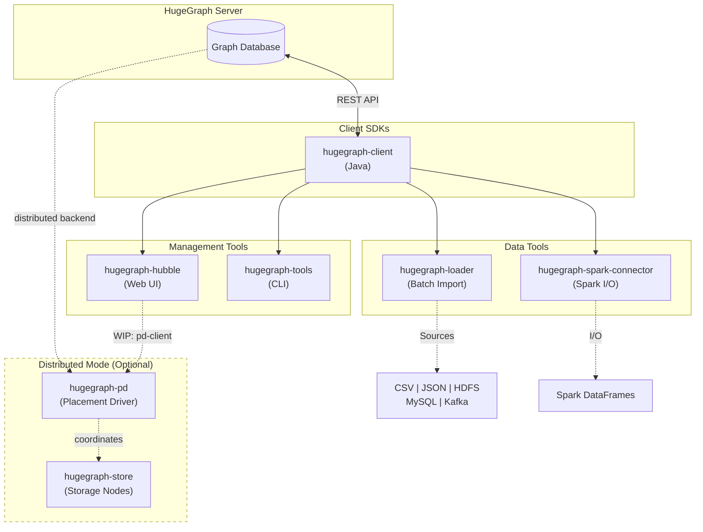

# hugegraph-toolchain

[](https://www.apache.org/licenses/LICENSE-2.0.html)
[](https://github.com/apache/hugegraph-toolchain/actions/workflows/client-ci.yml)
[](https://github.com/apache/hugegraph-toolchain/actions/workflows/loader-ci.yml)
[](https://github.com/apache/hugegraph-toolchain/actions/workflows/hubble-ci.yml)
[](https://github.com/apache/hugegraph-toolchain/actions/workflows/tools-ci.yml)
[](https://mvnrepository.com/artifact/org.apache.hugegraph/hugegraph-client)
[](https://deepwiki.com/apache/hugegraph-toolchain)

## What is HugeGraph Toolchain?

A comprehensive suite of client SDKs, data tools, and management utilities for [Apache HugeGraph](https://github.com/apache/hugegraph) graph database. Build applications, load data, and manage graphs with production-ready tools.

**Quick Navigation**: [Architecture](#architecture-overview) | [Quick Start](#quick-start) | [Modules](#module-overview) | [Build](#build--development) | [Docker](#docker) | [Related Projects](#related-projects)

## Related Projects

**HugeGraph Ecosystem**:
1. [hugegraph](https://github.com/apache/hugegraph) - Core graph database (**[pd](https://github.com/apache/hugegraph/tree/master/hugegraph-pd)** / **[store](https://github.com/apache/hugegraph/tree/master/hugegraph-store)** / **[server](https://github.com/apache/hugegraph/tree/master/hugegraph-server)** / **[commons](https://github.com/apache/hugegraph/tree/master/hugegraph-commons)**)
2. [hugegraph-computer](https://github.com/apache/hugegraph-computer) - Distributed graph computing system
3. [hugegraph-ai](https://github.com/apache/incubator-hugegraph-ai) - Graph AI/LLM/Knowledge Graph integration
4. [hugegraph-website](https://github.com/apache/hugegraph-doc) - Documentation and website

## Architecture Overview



<details>
<summary>ASCII diagram (for terminals/editors)</summary>

```
                    ┌─────────────────────────┐
                    │   HugeGraph Server      │
                    │   (Graph Database)      │
                    └───────────┬─────────────┘
                                │ REST API
        ┌ ─ ─ ─ ─ ─ ─ ─ ─ ─ ─ ─ ┼ ─ ─ ─ ─ ─ ─ ─ ─ ─ ─ ─ ┐
          Distributed (Optional)│
        │   ┌───────────┐       │       ┌───────────┐   │
            │hugegraph- │◄──────┴──────►│hugegraph- │
        │   │    pd     │               │   store   │   │
            └───────────┘               └───────────┘
        └ ─ ─ ─ ─ ─ ─ ─ ─ ─ ─ ─ ─ ─ ─ ─ ─ ─ ─ ─ ─ ─ ─ ─ ┘
                                │
          ┌─────────────────────┼─────────────────────┐
          │                     │                     │
          ▼                     ▼                     ▼
 ┌────────────────┐    ┌────────────────┐    ┌────────────────┐
 │ hugegraph-     │    │ Other Client   │    │  Other REST    │
 │ client (Java)  │    │ SDKs (Go/Py)   │    │  Clients       │
 └───────┬────────┘    └────────────────┘    └────────────────┘
         │ depends on
 ┌───────┼───────────┬───────────────────┐
 │       │           │                   │
 ▼       ▼           ▼                   ▼
┌────────┐ ┌────────┐ ┌──────────┐ ┌───────────────────┐
│ loader │ │ hubble │ │  tools   │ │ spark-connector   │
│ (ETL)  │ │ (Web)  │ │  (CLI)   │ │ (Spark I/O)       │
└────────┘ └────────┘ └──────────┘ └───────────────────┘
```
</details>

## Quick Start

### Prerequisites

| Requirement | Version | Notes |
|-------------|---------|-------|
| JDK | 11+ | LTS recommended |
| Maven | 3.6+ | For building from source |
| HugeGraph Server | 1.5.0+ | Required for client/loader |

### Choose Your Path

| I want to... | Use This | Get Started |
|--------------|----------|-------------|
| Visualize graphs via Web UI | Hubble | Docker: `docker run -p 8088:8088 hugegraph/hugegraph-hubble` |
| Load CSV/JSON data into graph | Loader | CLI with JSON mapping config ([docs](https://hugegraph.apache.org/docs/quickstart/hugegraph-loader/)) |
| Build a Java app with HugeGraph | Client | Maven dependency ([example](#hugegraph-client)) |
| Backup/restore graphs | Tools | CLI commands ([docs](https://hugegraph.apache.org/docs/quickstart/hugegraph-tools/)) |
| Process graphs with Spark | Spark Connector | DataFrame API ([module](#hugegraph-spark-connector)) |

### Docker Quick Start

```bash
# Hubble Web UI (port 8088)
docker run -d -p 8088:8088 --name hubble hugegraph/hugegraph-hubble

# Loader (batch data import)
docker run --rm hugegraph/hugegraph-loader ./bin/hugegraph-loader.sh -f example.json
```

## Module Overview

### hugegraph-client

**Purpose**: Official Java SDK for HugeGraph Server

**Key Features**:
- Schema management (PropertyKey, VertexLabel, EdgeLabel, IndexLabel)
- Graph operations (CRUD vertices/edges)
- Gremlin query execution
- Built-in traversers (shortest path, k-neighbor, k-out, paths, etc.)
- Multi-graph and authentication support

**Entry Point**: `org.apache.hugegraph.driver.HugeClient`

**Quick Example**:
```java
HugeClient client = HugeClient.builder("http://localhost:8080", "hugegraph").build();

// Schema management
client.schema().propertyKey("name").asText().ifNotExist().create();
client.schema().vertexLabel("person")
    .properties("name")
    .ifNotExist()
    .create();

// Graph operations
Vertex vertex = client.graph().addVertex(T.label, "person", "name", "Alice");
```

📖 [Documentation](https://hugegraph.apache.org/docs/quickstart/hugegraph-client/) | 📁 [Source](./hugegraph-client)

---

### Other Client SDKs

<details>
<summary><b>hugegraph-client-go</b> (Go SDK - WIP)</summary>

**Purpose**: Official Go SDK for HugeGraph Server

**Key Features**:
- RESTful API client for HugeGraph
- Schema and graph operations
- Gremlin query support
- Idiomatic Go interface

**Entry Point**: `github.com/apache/hugegraph-toolchain/hugegraph-client-go`

**Quick Example**:
```go
import "github.com/apache/hugegraph-toolchain/hugegraph-client-go"

client := hugegraph.NewClient("http://localhost:8080", "hugegraph")
// Schema and graph operations
```

📁 [Source](./hugegraph-client-go)

</details>

> **Looking for other languages?** See [hugegraph-python-client](https://github.com/apache/incubator-hugegraph-ai/tree/main/hugegraph-python-client) in the hugegraph-ai repository.

---

### hugegraph-loader

**Purpose**: Batch data import tool from multiple data sources

**Key Features**:
- **Sources**: CSV, JSON, HDFS, MySQL, Kafka, existing HugeGraph
- JSON-based mapping configuration
- Parallel loading with configurable threads
- Error handling and retry mechanisms
- Progress tracking and logging

**Entry Point**: `bin/hugegraph-loader.sh`

**Quick Example**:
```bash
# Load data from CSV
./bin/hugegraph-loader.sh -f mapping.json -g hugegraph

# Example mapping.json structure
{
  "vertices": [
    {
      "label": "person",
      "input": { "type": "file", "path": "persons.csv" },
      "mapping": { "name": "name", "age": "age" }
    }
  ]
}
```

📖 [Documentation](https://hugegraph.apache.org/docs/quickstart/hugegraph-loader/) | 📁 [Source](./hugegraph-loader)

---

### hugegraph-hubble

**Purpose**: Web-based graph management and visualization platform

**Key Features**:
- Schema management with visual editor
- Data loading interface
- Graph visualization and exploration
- Gremlin query console
- Multi-graph workspace management
- User authentication and authorization

**Technology Stack**: Spring Boot + React + TypeScript + MobX + Ant Design

**Entry Point**: `bin/start-hubble.sh` (default port: 8088)

**Quick Start**:
```bash
cd hugegraph-hubble/apache-hugegraph-hubble-incubating-*/bin
./start-hubble.sh      # Background mode
./start-hubble.sh -f   # Foreground mode
./stop-hubble.sh       # Stop server
```

📖 [Documentation](https://hugegraph.apache.org/docs/quickstart/hugegraph-hubble/) | 📁 [Source](./hugegraph-hubble)

---

### hugegraph-tools

**Purpose**: Command-line utilities for graph operations

**Key Features**:
- Backup and restore graphs
- Graph migration
- Graph cloning
- Metadata management
- Batch operations

**Entry Point**: `bin/hugegraph` CLI commands

**Quick Example**:
```bash
# Backup graph
bin/hugegraph backup -t all -d ./backup

# Restore graph
bin/hugegraph restore -t all -d ./backup
```

📁 [Source](./hugegraph-tools)

---

### hugegraph-spark-connector

**Purpose**: Spark integration for reading and writing HugeGraph data

**Key Features**:
- Read HugeGraph vertices/edges as Spark DataFrames
- Write DataFrames to HugeGraph
- Spark SQL support
- Distributed graph processing

**Entry Point**: Scala API with Spark DataSource v2

**Quick Example**:
```scala
// Read vertices as DataFrame
val vertices = spark.read
  .format("hugegraph")
  .option("host", "localhost:8080")
  .option("graph", "hugegraph")
  .option("type", "vertex")
  .load()

// Write DataFrame to HugeGraph
df.write
  .format("hugegraph")
  .option("host", "localhost:8080")
  .option("graph", "hugegraph")
  .save()
```

📁 [Source](./hugegraph-spark-connector)

## Maven Dependencies

```xml
<!-- Note: Use the latest release version in Maven Central -->
<dependency>
    <groupId>org.apache.hugegraph</groupId>
    <artifactId>hugegraph-client</artifactId>
    <version>1.7.0</version>
</dependency>

<dependency>
    <groupId>org.apache.hugegraph</groupId>
    <artifactId>hugegraph-loader</artifactId>
    <version>1.7.0</version>
</dependency>
```

Check [Maven Central](https://mvnrepository.com/artifact/org.apache.hugegraph) for the latest versions.

## Build & Development

### Full Build

```bash
mvn clean install -DskipTests -Dmaven.javadoc.skip=true -ntp
```

### Module-Specific Builds

| Module | Build Command |
|--------|---------------|
| Client | `mvn -e compile -pl hugegraph-client -Dmaven.javadoc.skip=true -ntp` |
| Loader | `mvn install -pl hugegraph-client,hugegraph-loader -am -DskipTests -ntp` |
| Hubble | `mvn install -pl hugegraph-client,hugegraph-loader -am -DskipTests -ntp && cd hugegraph-hubble && mvn package -DskipTests -ntp` |
| Tools | `mvn install -pl hugegraph-client,hugegraph-tools -am -DskipTests -ntp` |
| Spark | `mvn install -pl hugegraph-client,hugegraph-spark-connector -am -DskipTests -ntp` |
| Go Client | `cd hugegraph-client-go && make all` |

### Running Tests

| Module | Test Type | Command |
|--------|-----------|---------|
| Client | Unit (no server) | `mvn test -pl hugegraph-client -Dtest=UnitTestSuite` |
| Client | API (server needed) | `mvn test -pl hugegraph-client -Dtest=ApiTestSuite` |
| Client | Functional | `mvn test -pl hugegraph-client -Dtest=FuncTestSuite` |
| Loader | Unit | `mvn test -pl hugegraph-loader -P unit` |
| Loader | File sources | `mvn test -pl hugegraph-loader -P file` |
| Loader | HDFS | `mvn test -pl hugegraph-loader -P hdfs` |
| Loader | JDBC | `mvn test -pl hugegraph-loader -P jdbc` |
| Loader | Kafka | `mvn test -pl hugegraph-loader -P kafka` |
| Hubble | Unit | `mvn test -P unit-test -pl hugegraph-hubble/hubble-be` |
| Tools | Functional | `mvn test -pl hugegraph-tools -Dtest=FuncTestSuite` |

### Code Style

Checkstyle is enforced via `tools/checkstyle.xml`:
- Max line length: 100 characters
- 4-space indentation (no tabs)
- No star imports
- No `System.out.println`

Run checkstyle:
```bash
mvn checkstyle:check
```

## Docker

Official Docker images are available on Docker Hub:

| Image | Purpose | Port |
|-------|---------|------|
| `hugegraph/hugegraph-hubble` | Web UI | 8088 |
| `hugegraph/hugegraph-loader` | Data loader | - |

**Examples**:
```bash
# Hubble
docker run -d -p 8088:8088 --name hubble hugegraph/hugegraph-hubble

# Loader (mount config and data)
docker run --rm \
  -v /path/to/config:/config \
  -v /path/to/data:/data \
  hugegraph/hugegraph-loader \
  ./bin/hugegraph-loader.sh -f /config/mapping.json
```

Build images locally:
```bash
# Loader
cd hugegraph-loader && docker build -t hugegraph/hugegraph-loader:latest .

# Hubble
cd hugegraph-hubble && docker build -t hugegraph/hugegraph-hubble:latest .
```

## Documentation

- [HugeGraph Toolchain Overview](https://hugegraph.apache.org/docs/quickstart/)
- [hugegraph-client Guide](https://hugegraph.apache.org/docs/quickstart/hugegraph-client/)
- [hugegraph-loader Guide](https://hugegraph.apache.org/docs/quickstart/hugegraph-loader/)
- [hugegraph-hubble Guide](https://hugegraph.apache.org/docs/quickstart/hugegraph-hubble/)
- [API Reference](https://hugegraph.apache.org/docs/)

## Contributing

Welcome to contribute to HugeGraph! Please see [How to Contribute](https://hugegraph.apache.org/docs/contribution-guidelines/contribute/) for more information.

**Note**: It's recommended to use [GitHub Desktop](https://desktop.github.com/) to simplify the PR and commit process.

Thank you to all the people who already contributed to HugeGraph!

[](https://github.com/apache/hugegraph-toolchain/graphs/contributors)

## Community & Contact

- [GitHub Issues](https://github.com/apache/hugegraph-toolchain/issues) - Report bugs and request features
- Email: [dev@hugegraph.apache.org](mailto:dev@hugegraph.apache.org) ([subscriber](https://hugegraph.apache.org/docs/contribution-guidelines/subscribe/) only)
- Slack: [ASF Channel](https://the-asf.slack.com/archives/C059UU2FJ23)
- WeChat: Apache HugeGraph (scan QR code below)


## License

hugegraph-toolchain is licensed under [Apache 2.0 License](https://github.com/apache/hugegraph-toolchain/blob/master/LICENSE).
